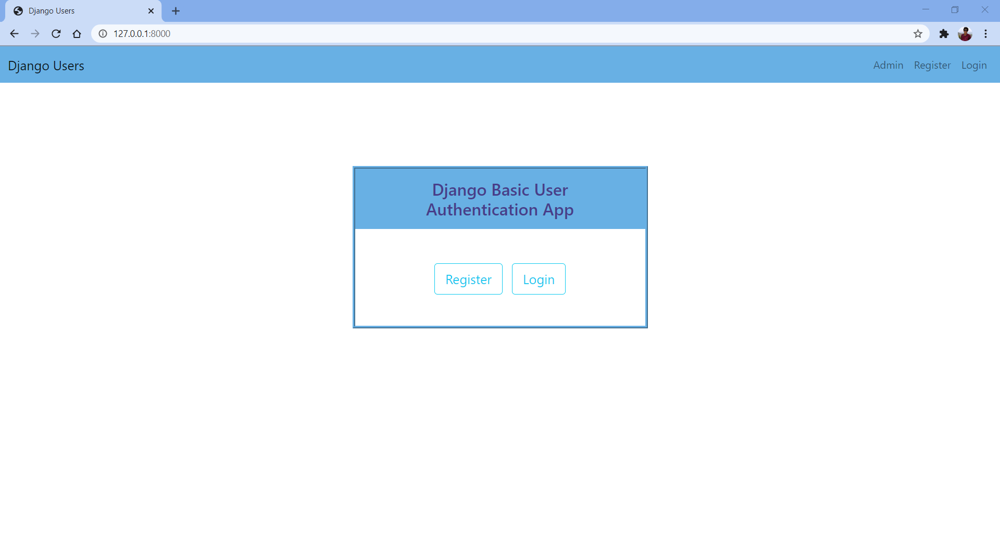
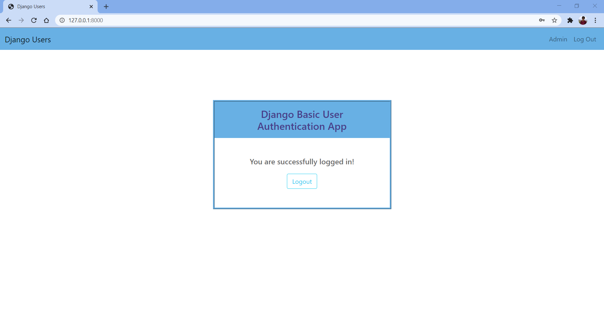
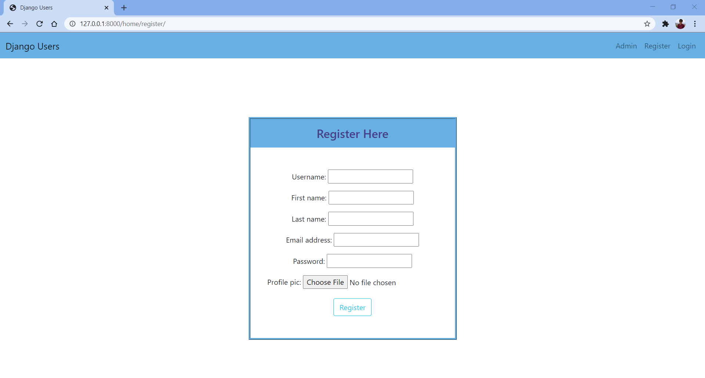

# Django-Basic-User-Authentication
Basic User Authentication app (Login/Sign in and Register/Sign up) implemented using Django and SQLite3 database in backend and HTML/CSS/Bootstrap in Frontend.

## Features
<ul>
  <li>Simple Login and Register Interface</li>
  <li>Users imformation is stored in Django's default database SQLite3</li>
  <li>Password is stored in encrypted format using Argon2 and bcrypt hashing algorithms</li>
</ul>

## Screenshots
| Homepage | Login |
| -------|--------------|
|  |  |

| Logout | Register |
| ---------------|------------------|
|  |  |

## Installing
### Clone the project

```
git clone https://github.com/DebRC/Django-Basic-User-Authentication.git
cd Django-Basic-User-Authentication-master
```

### Install dependencies & activate virtualenv

```
pip install virtualenv
virtualenv env
. env/Scripts/activate
```

### Run server
```
cd basic_sign
python manage.py runserver
```

### Admin Login
```
Username: admin
Password: 12345
```
