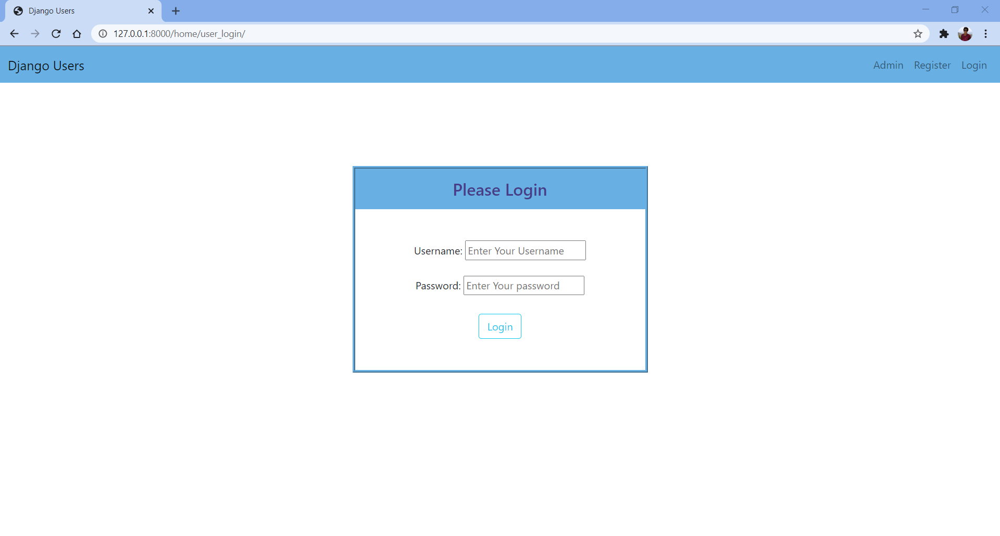

# Django-Basic-User-Authentication
Basic User Authentication app (Login/Sign in and Register/Sign up) implemented using Django and SQLite3 database in backend and HTML/CSS/Bootstrap in Frontend.

## Features
<ul>
  <li>Simple Login and Register Interface</li>
  <li>Users imformation is stored in Django's default database SQLite3</li>
  <li>Password is stored in encrypted format using Argon2 and bcrypt hashing algorithms</li>
</ul>

## Screenshots
#### Home Page

#### Login Page

#### Logout Page

#### Register Page

